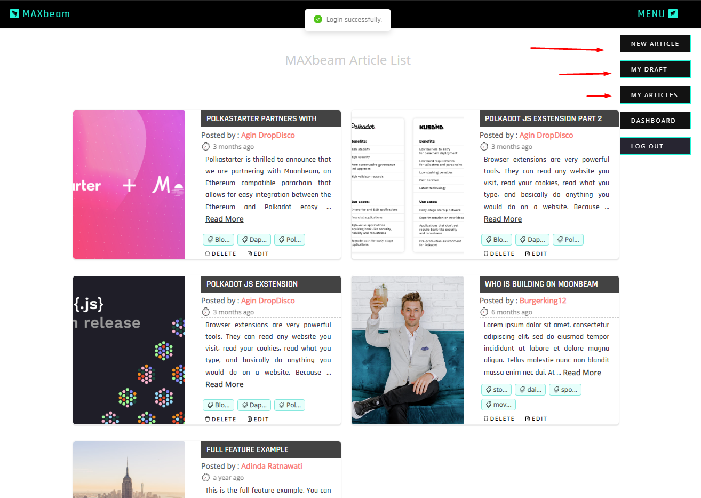
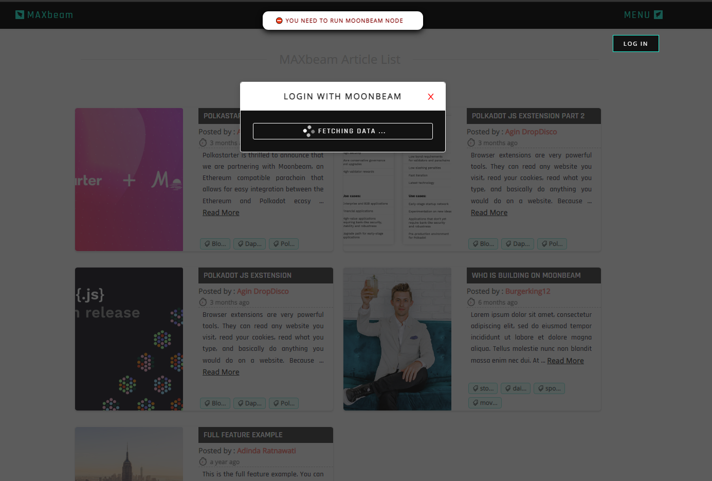
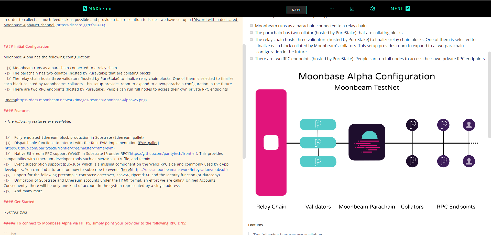
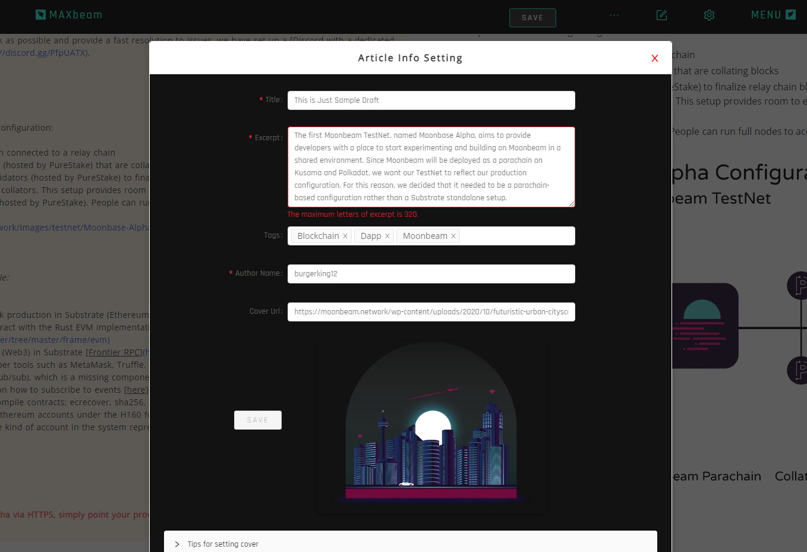
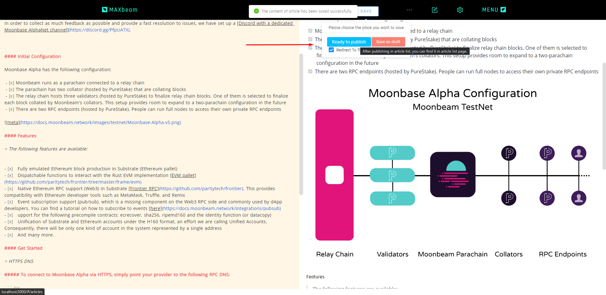
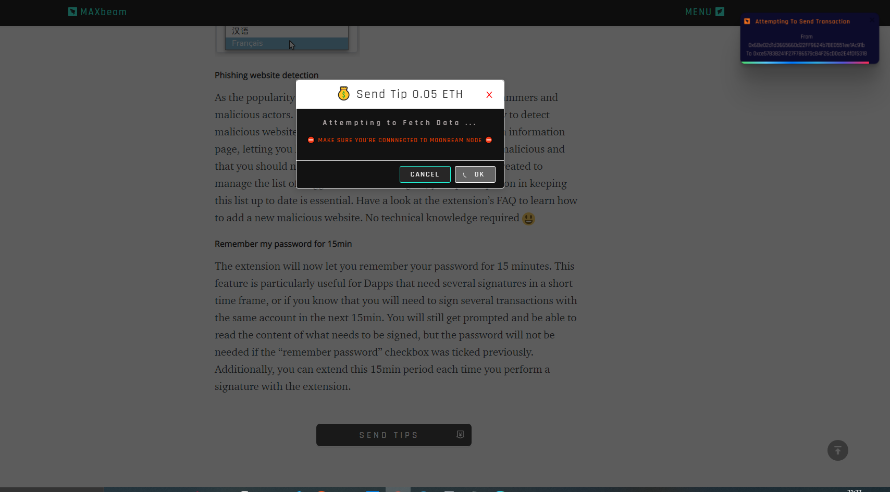
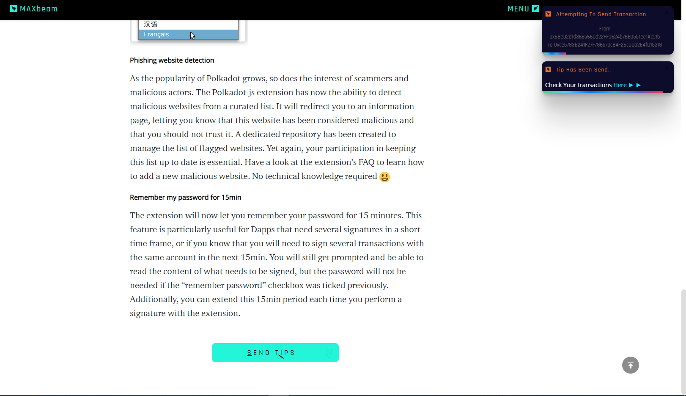
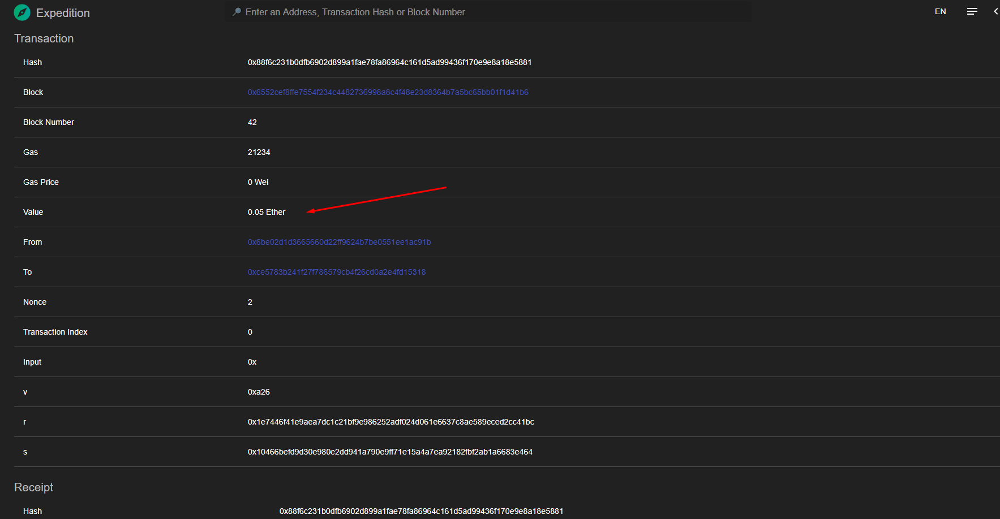

### Build Dapp on Polkadot Parachain

## Moonbeam 

### Dapp Name : MAXbeam

### [LIVE DEMO](https://maxbeam-app.web.app/)

### A simple markdown blog / article app built with Moonbeam, Etherjs, React, Pouch DB.
---


### { IF } Running Moonbeam node on your Local dev and login to MAXbeam website , and this App will be available to:

- [x] Create and Publish Article 

- [x] Send tip  to user that Integrates with  Moonbeam Node  

- [x] Export as Markdown or html file

- [x] And many more .

### { Else }
- [x] <del> Publish Story </del> 

- [x] <del> Send some Tips (ether) to user that Integrates with  Moonbeam Node  </del> 

- [x] <del> Add Comment  </del> 

- [x] <del>Export as Markdown or html file </del> 
---

> [LIVE DEMO](https://maxbeam-app.web.app/)


####  Only after logging in, you can see the editing option and create a new article
---
### Ran moonbeam stand alone node and login: 
- [x] 

### Error message  when try to login but not running moonbeam node
- [x] 

### Create, Edit && Publish Article
- [x] 
- [x] 
- [x] 

### Send Tips 
- [x] 
- [x] 
- [x] 

### Check the transaction
- [x] 


## Feature List

### Article System

- Edit article
  - Edit markdown
    - [x] Toggle editing and preview mode
    - [x] Sync scrolling of editing and preview panels
    - [x] Highlight the code of markdown according to its usage (I made the CodeMirror color theme)
    - [x] Prompt to save markdown after editing
    - [ ] Support some built-in snippets for markdown
  - Edit other elements
    - [x] Set the tags of article
    - [x] Set the title and excerpt of article
    - [x] Search the heading image based on keyword and set it (The heading image is also the cover of it in the article list)
    - [x] Preview the article info (Hovering on the **info setting button**)
- Manage article
  - [x] Create new article
  - [x] Publish article/save as draft
  - [x] Update article
  - [x] Removed article
- Export article
  - [x] Markdown file
  - [x] Styled HTML file
- Store article
  - [x] Local storage


### User System

- [x] User login/logout ( Now it only supports specified user to log in & Local Storage )

### Future

- [x] Will be available for every user, using JsonServer, lowDB & Substarte


## Showcase 

[YOUTUBE](#)


## Other resources

- [x] [Why only works for Local Storage ?](#)

- [x] [How to Change with Live API ?](#)

## Built With

- JS framework - [React](https://github.com/facebook/react/)
- Backend
   - [Moonbeam](https://docs.moonbeam.network/)
   - [PouchDB](https://github.com/pouchdb/pouchdb/)
   - [Ether](https://docs.ethers.io/)
- UI Composer - [Ant Design](https://github.com/ant-design/ant-design/)
- State Manager - [Redux](https://github.com/reactjs/redux/)
- Front-End Router - [React-Router](https://github.com/ReactTraining/react-router)
- Text editor - [CodeMirror](https://github.com/codemirror/CodeMirror/)
- markdown parser - [markdown-it](https://github.com/markdown-it/markdown-it/)
- Code highlighting - [Prism](https://github.com/PrismJS/prism/)
- Local storage - [PouchDB](https://github.com/pouchdb/pouchdb/)
- Photo search - [Unsplash](https://github.com/unsplash/unsplash-js)
- Photo display (like Pinterest) - [react-stack-grid](https://github.com/tsuyoshiwada/react-stack-grid)
- File export - [File Saver](https://github.com/eligrey/FileSaver.js/)
- Time transformation - [DayJS](https://github.com/iamkun/dayjs)

## Scripts

Run

```
$ yarn 

$ yarn start
```

Build

```
$ yarn build
```
