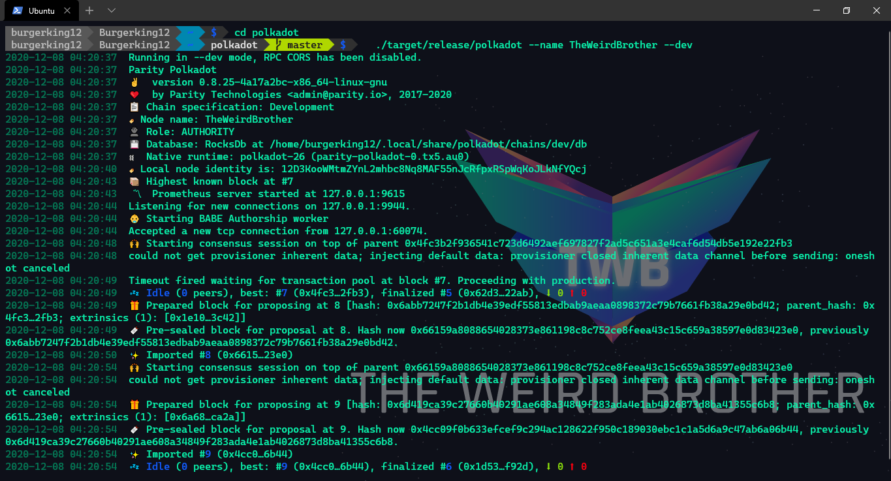
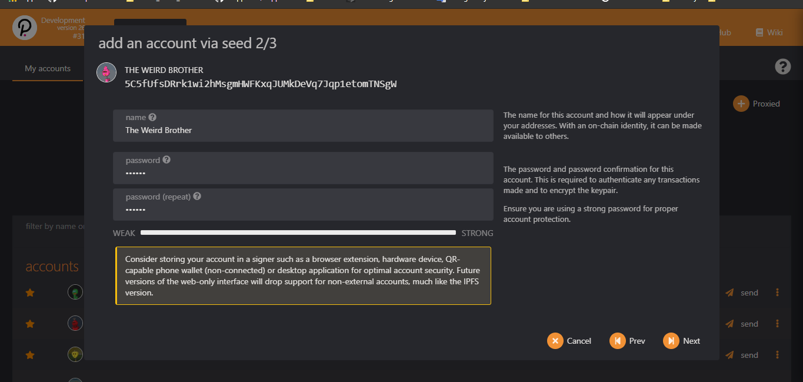

FRAME Identity
--------------

### Set Identity on Local Development Chain & Polkadot Development Chain {#set-identity-on-local-development-chain--polkadot-development-chain}

##### [Step by step how to add pallet to the runtime](https://palletruntime-6541c.web.app/)

### Requirement

-   [Subtrate](https://github.com/paritytech/substrate)
-   [Rust](https://rustup.rs/)
-   [Node Js](https://nodejs.org)
-   [LLVM](https://llvm.org/)
-   [Polkadot Node Template](https://github.com/paritytech/polkadot)
-   [Substrate Node
    Template](https://github.com/substrate-developer-hub/substrate-node-template)

##### Follow the commands below to prepare the environment. Some can be skipped if already installed. {#follow-the-commands-below-to-prepare-the-environment-some-can-be-skipped-if-already-installed}

``` {.hljs}
$ sudo apt update
$ sudo apt install -y build-essential ocaml ocamlbuild automake autoconf libtool wget python libssl-dev git cmake perl pkg-config curl llvm-10 clang-10 libclang-10-dev
$ curl --proto '=https' --tlsv1.2 -sSf https://sh.rustup.rs | sh
$ source ~/.cargo/env
$ curl -sL https://deb.nodesource.com/setup_current.x | sudo -E bash -
$ sudo apt-get install -y nodejs
```

##### Test the installation by running the following commands

``` {.hljs}
$ rustup --version
$ cargo --version
$ llvm-ar-10 --version
$ node --version
```

#### Clone Substrate Node Template and run the initialization script

``` {.hljs}
$ git clone https://github.com/substrate-developer-hub/substrate-node-template.git
$ cd substrate-node-template
$ make init
$ make build
```

#### connect to Local Node

``` {.hljs}
./target/release/node-template --name TheWeirdBrother --dev --tmp
```

#### Clone Polkadot code and run the initialization script

``` {.hljs}
$ git clone https://github.com/paritytech/polkadot.git
$ cd polkadot
$ cargo build --release
```

###### noted: If we got an issue when building with Rust, we can downgrading Rust. {#noted-if-we-got-an-issue-when-building-with-rust-we-can-downgrading-rust}

``` {.hljs}
$ rustup toolchain install nightly-2020-10-06
$ rustup install nightly-2020-10-06
$ rustup target add wasm32-unknown-unknown --toolchain nightly-2020-10-06
$ rustup install cargo +nightly-2020-10-06 
```

##### Then:

``` {.hljs}
$ cd polkadot
$ cargo +nightly-2020-10-06  build --release
```

###### noted: You can install Polkadot to your path via cargo

###### todo:

``` {.hljs}
$ cargo install --git https://github.com/paritytech/polkadot --tag <version> polkadot --locked
```

#### connect to Polkadot Node

``` {.hljs}
./target/release/polkadot --name TheWeirdBrother --dev
```

#### Now Configure the Apps

##### todo: {#todo}

-   go to the : [Polkadot apps](https://polkadot.js.org/apps/#/accounts)
-   Click Development Mode on the left Sidebar
-   Click Local Node and Switch
-   Click Settings, Developer
-   Type this

``` {.hljs}
  {"RefCount": "u8"}
```

-   Save

##### next

-   Click Add Account, and set your name and password [ next - save ]
-   Send some fund from Alice to your account

##### Now set Chain Identity

##### todo: {#todo}

-   Click gear icon
-   Set on-chain identity
-   Fill the form
-   Set Identity then Sign and Submit
-   Click your account to see your identity
-   DONE

##### eg:

### Set Identitty on Local Development Chain

 

### Set Identitty on Polkadot Development Chain

   
 

### What has been done?:

-   Create Frame Identity Tutorial

##### Resources

-   [Polkadot
    Wiki](https://wiki.polkadot.network/docs/en/learn-identity)
-   [Polkadat Node](https://github.com/paritytech/polkadot/releases)
-   [PolkadotJS Apps](https://polkadot.js.org/apps/#/explorer)
-   [Substrate Node Template](https://polkadot.js.org/apps/#/explorer)
-   [Frame Identity
    Module](https://github.com/paritytech/substrate/tree/master/frame/identity)
-   [Rust Docs. Identity
    Module](https://substrate.dev/rustdocs/v2.0.0/pallet_identity/index.html)
-   [How to Add Frame Pallet to a Substrate Node
    Template](https://polkadot.js.org/apps/#/explorer)

