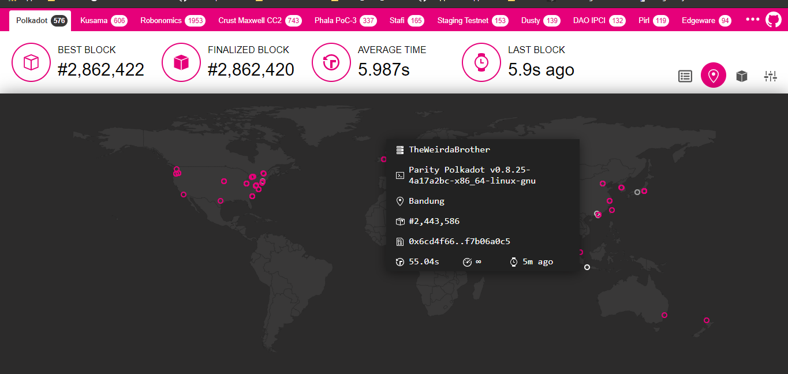
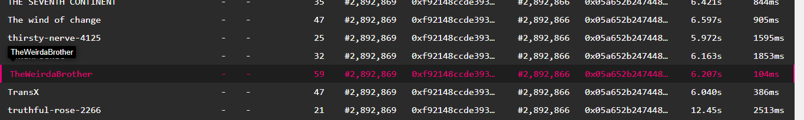

Run Polkadot node and add it to the telemetry
---------------------------------------------

### Requirement

-   [Polkadot](https://github.com/paritytech/polkadot)
-   [Subtrate](https://github.com/paritytech/substrate)
-   [Rust](https://rustup.rs/)
-   [Node Js](https://nodejs.org)
-   [Yarn](https://yarnpkg.com)
-   [LLVM](https://llvm.org/)

##### Follow the commands below to prepare the environment. Some can be skipped if already installed. {#follow-the-commands-below-to-prepare-the-environment-some-can-be-skipped-if-already-installed}

``` {.hljs}
$ sudo apt update
$ sudo apt install -y build-essential ocaml ocamlbuild automake autoconf libtool wget python libssl-dev git cmake perl pkg-config curl llvm-10 clang-10 libclang-10-dev
$ curl --proto '=https' --tlsv1.2 -sSf https://sh.rustup.rs | sh
$ source ~/.cargo/env
$ curl -sL https://deb.nodesource.com/setup_current.x | sudo -E bash -
$ sudo apt-get install -y nodejs
$ sudo npm install -g yarn
```

##### Test the installation by running the following commands

``` {.hljs}
$ rustup --version
$ cargo --version
$ llvm-ar-10 --version
$ node --version
$ yarn --version
```

#### Clone Polkadot code and run the initialization script

``` {.hljs}
$ git clone https://github.com/paritytech/polkadot.git
$ cd polkadot
$ cargo build --release
```

###### noted: If we got an issue when building with Rust, we can downgrading Rust. {#noted-if-we-got-an-issue-when-building-with-rust-we-can-downgrading-rust}

``` {.hljs}
$ rustup toolchain install nightly-2020-10-06
$ rustup install nightly-2020-10-06
$ rustup target add wasm32-unknown-unknown --toolchain nightly-2020-10-06
$ rustup install cargo +nightly-2020-10-06 
```

##### Then:

``` {.hljs}
$ cd polkadot
$ cargo +nightly-2020-10-06  build --release
```

###### noted: You can install Polkadot to your path via cargo

###### todo:

``` {.hljs}
$ cargo install --git https://github.com/paritytech/polkadot --tag <version> polkadot --locked
```

#### Let's connect to Polkadot Mainnet

``` {.hljs}
./target/release/polkadot --chain=polkadot --name TheWeirdBrother
```

#### Now check your node name on Polkadot Telemetry

##### todo: {#todo}

-   go to the : https://telemetry.polkadot.io/\#list/Polkadot
-   scroll down and find your node name

##### eg:

 

### What has been done?:

-   Run Polkadot node and add it to the telemetry

